# 體能訓練週期課表管理系統 — 系統分析文件

本目錄收錄體能訓練週期課表管理系統（Training Cycle Platform）的系統分析（SA）工作紀錄，從接到需求一路到結案的過程文件。

---

## 工作流程

下圖為整體路徑，點擊區塊可進入對應文件（若點擊沒反應，請改用下方「文件導引」）。

```mermaid
flowchart LR
    Start([新需求]) --> R
    R["<b>01 需求</b><br/>受理 · 利害關係人<br/>訪談 · 釐清 · 情境"]
    A["<b>02 分析</b><br/>As-Is · To-Be<br/>Gap · 範圍 · 可行性"]
    D["<b>03 設計</b><br/>Context · Use Case<br/>Activity · ER"]
    S["<b>04 規格</b><br/>FSD · NFR<br/>介面契約 · RTM"]
    G["<b>05 治理</b><br/>評審 · Baseline<br/>變更 · UAT · 結案"]
    R --> A --> D --> S --> G --> End([結案 / 維運])

    click R "docs/01-requirements.md" "進入 01 需求"
    click A "docs/02-analysis.md" "進入 02 分析"
    click D "docs/03-design.md" "進入 03 設計"
    click S "docs/04-specification.md" "進入 04 規格"
    click G "docs/05-governance.md" "進入 05 治理"

    classDef doc1 fill:#E8F1FF,stroke:#5B8DEF,color:#1F3A68;
    classDef doc2 fill:#EAF6EE,stroke:#4CAF7A,color:#1F4D34;
    classDef doc3 fill:#FFF4E5,stroke:#E0A030,color:#5C3A00;
    classDef doc4 fill:#F4ECFB,stroke:#9B6BCC,color:#3A1F5C;
    classDef doc5 fill:#FDECEC,stroke:#D86A6A,color:#5C1F1F;
    class R doc1;
    class A doc2;
    class D doc3;
    class S doc4;
    class G doc5;
```

---

## 文件導引

| 階段 | 文件                                                 | 主要內容                                             |
| ---- | ---------------------------------------------------- | ---------------------------------------------------- |
| 需求 | [docs/01-requirements.md](docs/01-requirements.md)   | 需求受理、利害關係人、訪談、需求釐清、情境彙整       |
| 分析 | [docs/02-analysis.md](docs/02-analysis.md)           | As-Is / To-Be、Gap、範圍界定、可行性評估             |
| 設計 | [docs/03-design.md](docs/03-design.md)               | 系統 Context、Use Case、Activity Diagram、ER Diagram |
| 規格 | [docs/04-specification.md](docs/04-specification.md) | 功能規格、非功能規格、介面契約、需求追溯矩陣         |
| 治理 | [docs/05-governance.md](docs/05-governance.md)       | 評審簽核、Baseline、變更管理、UAT、上線結案          |

---

## 系統簡介

體能訓練週期課表管理系統是一套為體能教練設計的整合性系統，將「週期 / 固定課表設計」、「學員行事曆排程」與「VALD Performance 檢測數據」整合於同一平台，取代教練原本以 Google Sheets 加上 VALD 後台手動整合的工作方式。

---

## 技術棧

| 層次     | 技術                                                                                                                   |
| -------- | ---------------------------------------------------------------------------------------------------------------------- |
| 前端     | Vue 3、TypeScript、Vite、Pinia、Vue Router、Element Plus、Tailwind CSS、Vue I18n、ECharts                              |
| 後端     | .NET 10、ASP.NET Core Web API、Entity Framework Core 10、ASP.NET Identity（JWT + Refresh Token）、Serilog、Swashbuckle |
| 資料庫   | PostgreSQL (Npgsql)                                                                                                    |
| 外部整合 | VALD Performance API（OAuth2 Client Credentials）                                                                      |
| 測試     | xUnit、Moq、Testcontainers for PostgreSQL（後端）；Vitest、Playwright（前端）                                          |
| CI/CD    | GitHub Actions；部署至 Render（dev / prod 雙環境，透過 Deploy Hook）                                                   |

---

下一份：[01. 需求 (Requirements)](docs/01-requirements.md)

# training-cycle-platform-specs
