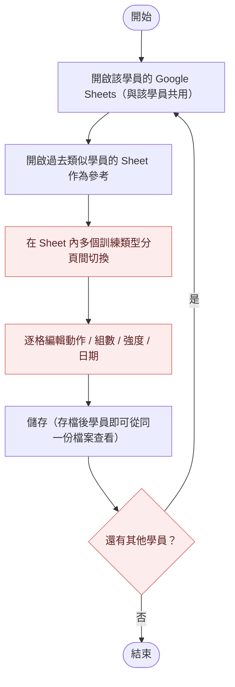
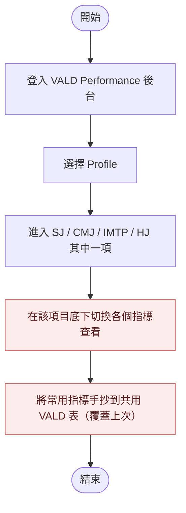
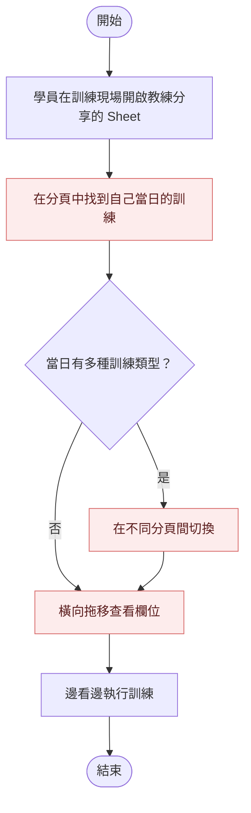
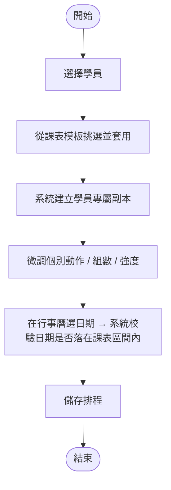
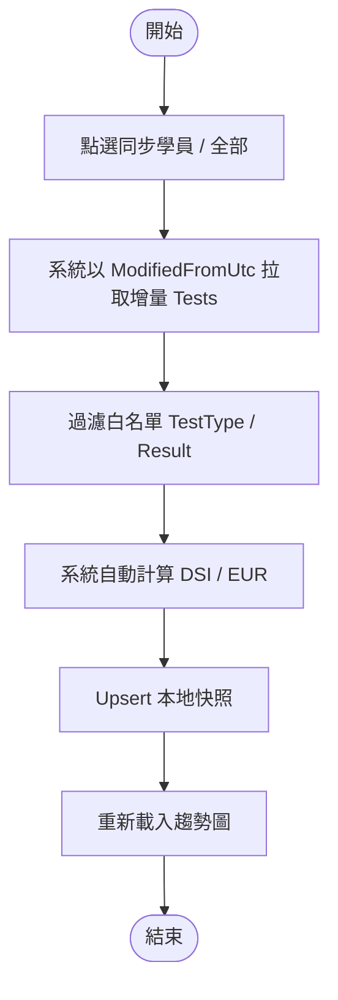
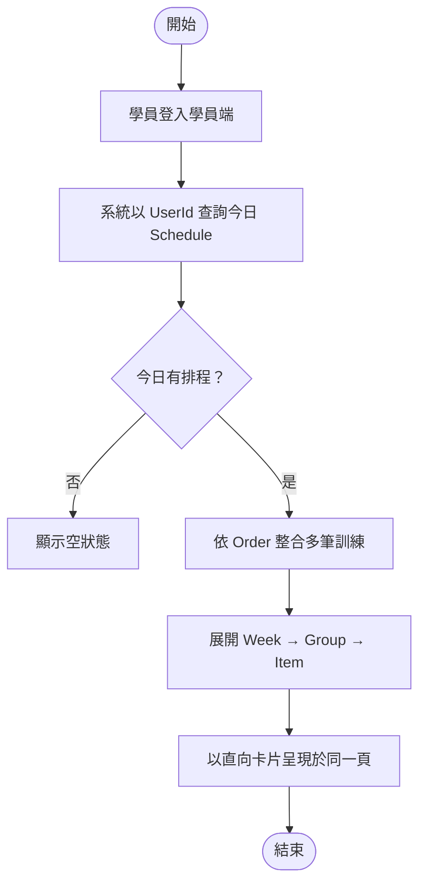

# 02. 分析 (Analysis)

本文件記錄體能訓練週期課表管理系統在「分析」階段的工作過程：盤點教練現行的工作流程（As-Is）、規劃導入系統後的目標流程（To-Be）、量化兩者差距，界定第一版範圍，並評估可行性與主要風險。

---

## 2.1 As-Is 流程盤點

以下三個流程是教練在系統建置前的實際工作方式，整理自現場操作觀察。每個流程後標註觀察到的痛點。

### 流程 A — 教練排課

| 步驟           | 痛點                                                                            |
| -------------- | ------------------------------------------------------------------------------- |
| 分頁切換       | 同一位學員的不同訓練類型（核心 / 活動度 / 肌力 等）分散在多個分頁，編輯反覆切換 |
| 逐格編輯       | Google Sheets 並非為結構化課表設計，動作 / 組數 / 強度 / 日期都得逐格手動處理   |
| 對其他學員重複 | 上述全部步驟要對 50+ 位學員逐一執行                                             |

### 流程 B — VALD 檢測資料查詢與紀錄

| 步驟               | 痛點                                             |
| ------------------ | ------------------------------------------------ |
| 切換指標查看       | 後台每次切換指標需等 5 秒以上                    |
| 手抄到共用 VALD 表 | 所有學員共用一張表，每次排課覆蓋上次；無歷史可追 |

### 流程 C — 學員現場查課

| 步驟             | 痛點                                  |
| ---------------- | ------------------------------------- |
| 找自己的當日訓練 | 分頁多、結構複雜，學員難以閱讀        |
| 切換分頁         | 訓練中斷感明顯                        |
| 橫向拖移         | 動作說明不易讀；組數 / 強度欄位被截斷 |

---

## 2.2 To-Be 流程設計

針對 As-Is 三流程，導入系統後的目標流程如下。流程僅描述「教練與學員會看到什麼」，技術層級的元件與資料表交給 [03-design.md](03-design.md) 處理。

### 流程 A' — 教練排課（新）

關鍵差異：模板與學員副本解耦、日期由行事曆 UI 控制、區間校驗由系統執行。

### 流程 B' — VALD 同步（新）

關鍵差異：增量同步、自動計算、本地快照取代手抄。

### 流程 C' — 學員今日訓練（新）

關鍵差異：以「今日訓練」為入口、同日多種訓練彙整於一頁、直向卡片取代橫向 Sheet。

---

## 2.3 Gap 分析

將 As-Is 與 To-Be 並列，量化差異。

| 構面           | As-Is                                        | To-Be                                | 差異                               |
| -------------- | -------------------------------------------- | ------------------------------------ | ---------------------------------- |
| 課表來源       | 每位學員一份 Google Sheets，含多訓練類型分頁 | 集中課表模板 + 每位學員獨立副本      | 課表內容統一收斂，介面為課表而設計 |
| 重用機制       | 無模板概念，每位學員獨立維護、無法批量套用   | 模板套用後自動建立學員獨立副本       | 設計一次可套用多位學員             |
| 排課時間       | 單人 35~45 分鐘                              | 單人 7~10 分鐘                       | 效率提升 75%+                      |
| VALD 查詢      | 後台每次切換指標等 5 秒以上                  | 一鍵同步、本地查詢即時               | 查看速度提升 95%+                  |
| 歷史檢測資料   | 共用一張 VALD 表，每次排課手抄覆蓋上次       | 本地 `vald_test_metric_records` 快照 | 可追溯                             |
| 學員查課裝置   | 手機開 Sheet、橫向拖移                       | 手機優先 RWD、直向卡片               | 操作摩擦大幅降低                   |
| 同日多訓練類型 | 分散在不同分頁                               | 同一頁依排程順序整合                 | 訓練連續性                         |

---

## 2.4 範圍界定 Scope

### In Scope（第一版交付）

| 範疇              | 涵蓋內容                                                     |
| ----------------- | ------------------------------------------------------------ |
| 課表模板管理      | 模板的建立、編輯、刪除、複製套用                             |
| 學員課表管理      | 從模板建立學員專屬副本、起訖日期、微調                       |
| 行事曆排程        | 為學員安排訓練日期、同日順序、區間校驗                       |
| 動作庫管理        | 全域動作資料、課表項目引用、刪除後保留歷史名稱               |
| VALD Profile 同步 | 從 VALD Group 單向匯入運動員、建立帳號                       |
| VALD Test 同步    | 增量同步 SJ / CMJ / IMTP / HJ 白名單指標、自動計算 DSI / EUR |
| 學員端今日訓練    | 手機優先 RWD、依排程整合今日訓練、直向卡片                   |
| 歷史檢測查詢      | 本地快照支援的趨勢圖與表格                                   |
| 認證授權          | 權限管理、登入、JWT + Refresh Token                          |

### Out of Scope（後續迭代或不在本案內）

| 範疇                                                     | 處理方式                           |
| -------------------------------------------------------- | ---------------------------------- |
| 跑步 / 體能手動資料（30m / 40m / 60m / VO2Max 6 分折返） | 列入後續迭代；資料邊界與 UI 已預留 |
| 衍生指標延伸（除 DSI / EUR 外其他）                      | 後續視需求補上                     |
| 行動原生 App                                             | 不納入；RWD 涵蓋手機需求即可       |

### 前置假設

| 假設                 | 影響                             |
| -------------------- | -------------------------------- |
| 教練本人為唯一決策者 | 需求變更可即時拍板，不需多方審批 |

### 限制

| 限制                      | 來源           | 因應                                                    |
| ------------------------- | -------------- | ------------------------------------------------------- |
| VALD API 限流             | 第三方政策     | 同步流程逐筆拉取 Trial，遇 429 重試；歷史查詢走本地快照 |
| VALD Profile 可能缺 email | 第三方資料品質 | 缺 email 時略過建立帳號並回報失敗                       |

---

## 2.5 可行性評估

### 技術可行性

| 層次   | 採用技術                                                          | 評估                                                   |
| ------ | ----------------------------------------------------------------- | ------------------------------------------------------ |
| 前端   | Vue 3、TypeScript、Vite、Element Plus、Tailwind CSS、ECharts      | 成熟生態系，能滿足 RWD、圖表、表單需求                 |
| 後端   | .NET 10、ASP.NET Core Web API、EF Core 10、ASP.NET Identity       | 成熟框架；JWT + Refresh Token 直接由 Identity 套件支援 |
| 資料庫 | PostgreSQL (Npgsql)                                               | 支援所需的關聯模型；EF Core 支援度高                   |
| 部署   | Render（dev / prod 雙環境，Deploy Hook）                          | 既有帳號與 Pipeline，部署成本低                        |
| 測試   | xUnit + Moq + Testcontainers（後端）、Vitest + Playwright（前端） | 既有實踐，可覆蓋單元與整合測試                         |

技術選型上沒有需新引入的高風險元件。

### 整合可行性 — VALD Performance

VALD 是唯一的外部整合對象，其可行性是本案的關鍵：

| 議題         | 評估                                                                 |
| ------------ | -------------------------------------------------------------------- |
| 認證方式     | OAuth2 Client Credentials；教練可申請 Client；流程明確               |
| 資料來源     | Profile（含 Group）、ForceDecks Tests / Trials；皆為唯讀拉取         |
| 增量同步     | API 提供 `modifiedFromUtc` 篩選；以本地最新 `RecordedDateUtc` 為起點 |
| 限流         | 拉取 Trials 時可能遇 429；以重試 + 排程處理                          |
| Profile 對齊 | 以 `ValdProfileId` 唯一辨識；不以 email 對齊以避免衝突               |
| 寫入方向     | 單向：VALD → 本系統；本系統不反向寫回                                |

### VALD Profile 同步策略：從雙向到單向

「寫入方向」一欄定為單向，是經過一段技術卡關後重新對齊需求的結果。最初設想為雙向同步（系統可建立 / 更新 VALD Profile），但實作時遇到 VALD 端的根本限制：

| 限制                                | 影響                                                                                             |
| ----------------------------------- | ------------------------------------------------------------------------------------------------ |
| Profile 無唯一識別欄位              | 姓名 / 生日 / Email 皆可重複，無法保證一定對齊到指定的某一筆                                     |
| `/profiles/import` 為建立與更新共用 | 依「SyncId → 姓名+生日+Email → 姓名+生日」自動判斷新建或更新；欄位稍有偏差即默默建出重複 Profile |
| 既有重複 Profile 無法在我方解決     | 只能由教練在 VALD 端清理                                                                         |

實際與教練確認後也釐清：**首次檢測時 Profile 都是在 VALD 系統當場建立**，教練的建檔習慣不會改到我方。即使把雙向同步做得再完整，也只是多此一舉並增加汙染對方資料庫的風險。因此改採「VALD 為單一真實來源」：

- 只從 VALD 讀進本系統，**本系統不反向寫回**
- 以 `ValdProfileId` 為錨點對齊，不靠 email
- 同步時偵測到 VALD 端 Email 重複，僅回報衝突由教練在 VALD 端處理

### 主要風險與因應

| 風險                | 影響                  | 因應                                                |
| ------------------- | --------------------- | --------------------------------------------------- |
| VALD API 規格變動   | 同步失敗或欄位錯位    | 以 Contract Test 監控；明確記錄目前依賴的欄位與型別 |
| VALD API 暫時不可用 | 教練無法同步最新檢測  | 歷史查詢走本地快照，UI 顯示「上次同步時間」         |
| Profile 缺 email    | 無法建立 Athlete 帳號 | 同步流程個別跳過並回報失敗筆數，不中斷整體流程      |

---

## 小結

本階段完成：

- 三個 As-Is 流程與其痛點標註
- 三個 To-Be 流程與關鍵差異
- 量化的 Gap 分析（時間、一致性、操作摩擦）
- In / Out of Scope 邊界、前置假設與限制
- 技術與 VALD 整合可行性，以及對應風險清單

下一階段（[03-design.md](03-design.md)）會以這些情境、範圍與風險為輸入，產出系統 Context、Use Case、Activity Diagram 與 ER Diagram。

---

上一份：[01. 需求 (Requirements)](01-requirements.md) ／ 回上層：[文件導引](../README.md) ／ 下一份：[03. 設計 (Design)](03-design.md)
