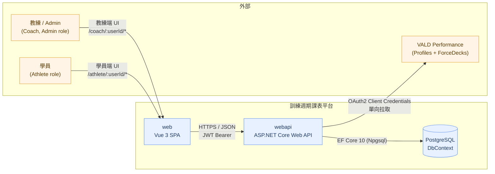
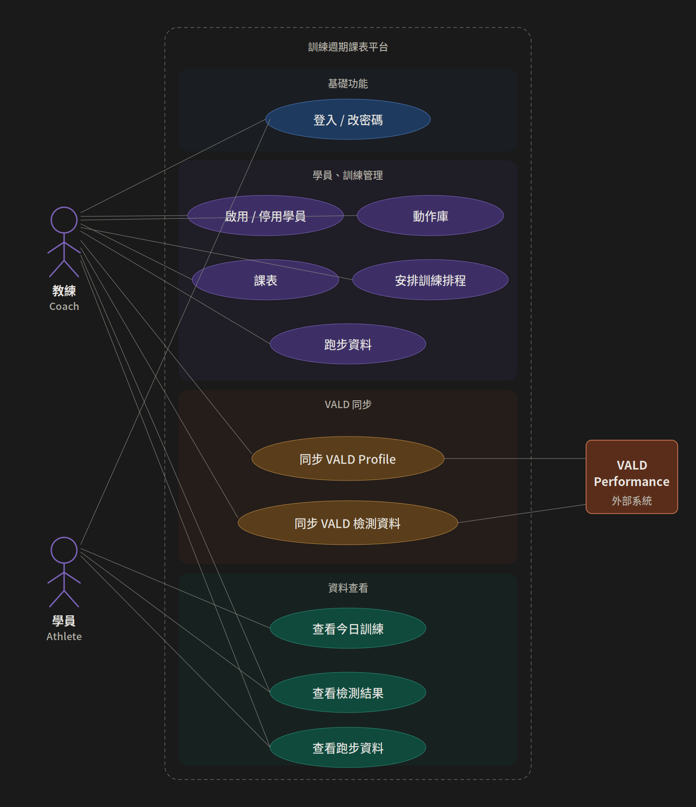
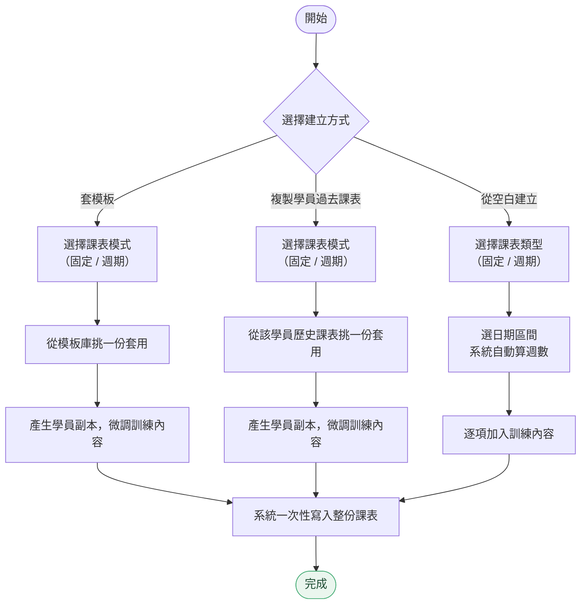
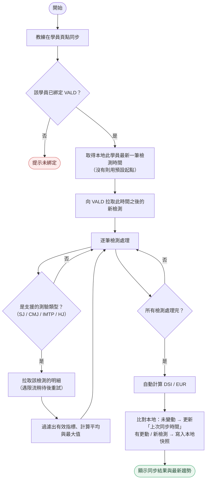
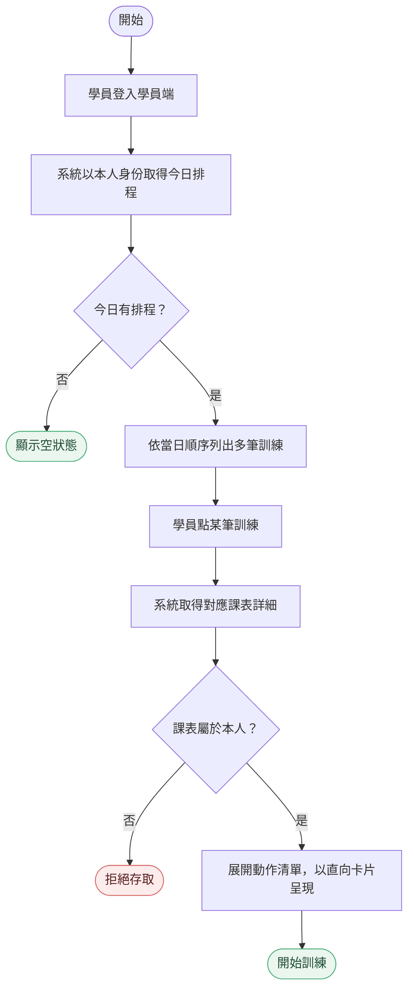

# 03. 設計 (Design)

本文件以 [02-analysis.md](02-analysis.md) 的情境、範圍與風險為輸入，從外部環境一路往內收斂：先界定系統與外部使用者 / 系統的互動邊界（Context），再展開角色可執行的 Use Case，接著針對其中三條核心流程畫出 Activity Diagram，最後以 ER Diagram 收尾資料模型。

設計階段的目的是把「要做什麼」翻譯成「資料、流程、邊界各長什麼樣」，作為下一階段 [04-specification.md](04-specification.md) 撰寫功能規格與介面契約的依據。

## 目錄

- [3.1 系統 Context](#31-系統-context)
  - [邊界與外部互動](#邊界與外部互動)
  - [外部介面](#外部介面)
  - [部署 Context](#部署-context)
- [3.2 Use Case](#32-use-case)
  - [Actor 定義](#actor-定義)
  - [Use Case 全景圖](#use-case-全景圖)
  - [Use Case 與 API 對照](#use-case-與-api-對照)
- [3.3 Activity Diagram](#33-activity-diagram)
  - [流程 1 — 教練建立 / 更新學員課表](#流程-1--教練建立--更新學員課表)
  - [流程 2 — VALD 學員檢測增量同步](#流程-2--vald-學員檢測增量同步)
  - [流程 3 — 學員端查看今日訓練](#流程-3--學員端查看今日訓練)
- [3.4 ER Diagram](#34-er-diagram)
  - [整體 ER](#整體-er)
  - [關鍵設計取捨](#關鍵設計取捨)
  - [設計鉤點與需求的對應](#設計鉤點與需求的對應)
- [小結](#小結)

---

## 3.1 系統 Context

### 邊界與外部互動

系統對外只與兩類使用者與一個第三方服務互動，內部由 Web 前端、Web API 後端與 PostgreSQL 構成。

### 外部介面

| 介面              | 方向     | 協定                                           | 用途                                                                                                                               |
| ----------------- | -------- | ---------------------------------------------- | ---------------------------------------------------------------------------------------------------------------------------------- |
| 使用者 → Web      | 雙向     | HTTPS（瀏覽器）                                | 教練端與學員端 UI；學員端以手機 RWD 為主                                                                                           |
| Web → Web API     | 雙向     | HTTPS / JSON；`Authorization: Bearer <jwt>`    | 所有業務 API；統一以「成功旗標 + 錯誤碼 / 訊息 + 資料」三段式結構回應                                                              |
| Web API → DB      | 雙向     | TCP（Npgsql）                                  | EF Core 10；應用層資料與 ASP.NET Identity 同庫                                                                                     |
| Web API → VALD    | 單向拉取 | HTTPS / JSON；OAuth2 Client Credentials Bearer | 取 Profiles / Groups / Tests / Trials                                                                                              |
| 系統 → VALD（寫） | 不啟用   | —                                              | 本系統不反向寫回 VALD；改採單向的原因見 [02-analysis.md § VALD Profile 同步策略](02-analysis.md#vald-profile-同步策略從雙向到單向) |

### 部署 Context

| 環境 | 用途            | 觸發方式                            |
| ---- | --------------- | ----------------------------------- |
| dev  | 開發 / 整合測試 | GitHub Actions → Render Deploy Hook |
| prod | 正式環境        | GitHub Actions → Render Deploy Hook |

> 詳細的部署管線與環境變數治理由 [05-governance.md](05-governance.md) 處理；此處只標明系統邊界。

---

## 3.2 Use Case

### Actor 定義

系統內共有三種角色，由 ASP.NET Identity 與 JWT 中的角色聲明承載；後端每支 API 都明確標記可進入的角色：

| Actor   | 來源                    | 對應 UI 區段                | 主要關注的子網域                                  |
| ------- | ----------------------- | --------------------------- | ------------------------------------------------- |
| Admin   | Identity Role `Admin`   | 教練端 `/coach/:userId/*`   | 與 Coach 同；保留管理擴充                         |
| Coach   | Identity Role `Coach`   | 教練端 `/coach/:userId/*`   | 動作庫、課表模板、學員課表、行事曆排程、VALD 同步 |
| Athlete | Identity Role `Athlete` | 學員端 `/athlete/:userId/*` | 自己的今日訓練、課表內容、VALD 檢測結果、跑步資料 |

> Route Guards：除了角色檢查外，路由帶 `:userId` 時會與 JWT 中的 `userId` 比對；不符即視為未授權，導向 NotFound。

### Use Case 全景圖

### Use Case 與 API 對照

| Use Case                                   | HTTP                        | 路由                                                                              | 授權角色                 |
| ------------------------------------------ | --------------------------- | --------------------------------------------------------------------------------- | ------------------------ |
| 登入 / Refresh / 登出                      | POST                        | `/auth/login` / `/auth/refresh` / `/auth/logout`                                  | Anonymous（限流）        |
| 取得個人資料                               | GET                         | `/user/profile`                                                                   | Admin, Coach, Athlete    |
| 修改密碼                                   | POST                        | `/user/changePassword`                                                            | Admin, Coach, Athlete    |
| 動作庫查詢 / 新增 / 編輯 / 刪除            | POST / POST / POST / DELETE | `/training/exercise/{query,create,update,delete/{id}}`                            | Admin, Coach             |
| 課表（模板 + 學員專屬）查詢 / Detail       | POST / GET                  | `/training/cycle/query` / `/training/cycle/query/{id}/detail`                     | Admin, Coach             |
| 課表 整批建立 / 整批更新                   | POST / POST                 | `/training/cycle/create-full` / `/training/cycle/update-full/{id}`                | Admin, Coach             |
| 課表 一般 CRUD                             | POST / POST / DELETE        | `/training/cycle/{create,update,delete/{id}}`                                     | Admin, Coach             |
| Week / Group / Item 維護                   | POST / POST / POST / DELETE | `/training/cycle-week/*` `/training/exercise-group/*` `/training/exercise-item/*` | Admin, Coach             |
| 學員自助：查自己的 cycles / detail         | POST / GET                  | `/training/my-cycle/query` / `/training/my-cycle/query/{id}/detail`               | Athlete                  |
| 學員查詢 / 啟用停用                        | POST / PATCH                | `/athlete/query` / `/athlete/{id}/status`                                         | Admin, Coach             |
| VALD：列 Groups                            | GET                         | `/vald/groups`                                                                    | Admin, Coach             |
| VALD：同步 Profiles → 建立 Athlete         | POST                        | `/athlete/vald/{groupId?}/sync-profiles`                                          | Admin, Coach             |
| VALD：以 VALD Profile 更新單一學員         | PATCH                       | `/athlete/vald/{athleteId}/update-profile`                                        | Admin, Coach             |
| VALD：增量同步學員 Tests                   | GET                         | `/athlete/vald/{athleteId}/sync-tests`                                            | Admin, Coach             |
| 區間查 VALD 結果（本地快照、含 DSI / EUR） | GET                         | `/athlete/vald/{athleteId}/tests?fromDate=&toDate=`                               | Admin, Coach, Athlete    |
| 排程 查詢 / 建立 / 同日重排 / 刪除         | POST / POST / POST / DELETE | `/athlete/schedule/{query,create,reorder-day,delete}`                             | Admin, Coach             |
| 學員自助：查自己排程                       | POST                        | `/athlete/my-schedule/query`                                                      | Athlete                  |
| 跑步資料 查詢 / Upsert / 刪除              | GET / POST / DELETE         | `/athlete/{athleteId}/running-data` / `.../create-or-update` / `.../{id}`         | Admin, Coach（學員可讀） |

---

## 3.3 Activity Diagram

選取三條跨多個元件、且具決策分支的核心流程：教練端「整批建立 / 更新一份學員課表」、VALD「增量同步學員檢測」與學員端「查看今日訓練」。

### 流程 1 — 教練建立 / 更新學員課表

教練建立一份學員課表時，可選三種起手方式：套模板、複製學員過去的課表、或從空白開始。

關鍵設計點：

- 三條路徑最後落到同一份結構（基本資料 + 多週 + 動作組 + 動作項），由系統一次性寫入避免半成品。
- 「固定」與「週期」共用同一資料結構，差別在於週數的呈現方式。
- 模板與學員副本解耦：套用後產生獨立副本，後續微調不會回頭影響來源。

### 流程 2 — VALD 學員檢測增量同步

關鍵設計點：

- **增量起點**取自本地最新一筆檢測時間，不由教練手動指定，避免漏抓或重抓。
- **指標白名單**：每種測驗類型只取事先驗證過的指標，避免未經審視的欄位進入本地表。
- **限流容忍**：對 VALD 拉明細時固定間隔，遇限流會退避重試；不阻斷整體流程。
- **歷史查詢走本地快照**：教練之後查趨勢圖不再打 VALD；快照同時保留「上次同步時間」可顯示。
- **DSI / EUR 由系統自動計算**，取代教練在 Sheet 內手動套公式。

### 流程 3 — 學員端查看今日訓練

關鍵設計點：

- 學員端所有查詢都以登入身份為準，不信任前端傳入的「我是誰」，避免越權。
- 學員端只讀不寫；建立 / 調整排程一律由教練端執行。
- 同日多筆訓練依排程順序整合於一頁，不再讓學員自行在多個分頁間切換。

> 「教練排課」的整體流程（選學員 → 套模板 → 微調 → 排日期）由「流程 1（整批建 / 更）」與「排程建立」兩段組成，UI 層的細節留待 [04-specification.md](04-specification.md) 的功能規格。

---

## 3.4 ER Diagram

### 整體 ER

> 原始檔： [`../assets/er-diagram.dbml`](../assets/er-diagram.dbml)，開啟 <https://dbdiagram.io/d> 後將內容貼入即可即時渲染。

### 關鍵設計取捨

| 取捨                                          | 為什麼這樣設計                                                                                                                                                 |
| --------------------------------------------- | -------------------------------------------------------------------------------------------------------------------------------------------------------------- |
| 課表的「歸屬學員」欄位可空                    | 同一張課表表同時承載「模板」（無歸屬）與「學員專屬副本」（有歸屬），避免另開一張模板表與並行邏輯（呼應 [01-requirements.md](01-requirements.md) 1.4 釐清案例） |
| 以「週次 = 0」表示固定課表                    | 不為「固定課表」新建資料表；既有結構直接承接                                                                                                                   |
| 動作項保留名稱、且允許脫離動作庫              | 動作庫項目被刪除時，動作項上的引用清空但保留歷史名稱；舊課表仍可閱讀，動作庫刪除不會變成全域破壞性操作                                                         |
| 檢測資料以 VALD profile id 對齊學員，不設外鍵 | 同步與資料載入是兩條獨立軌道；VALD 端可能存在尚未在本地建立帳號的 Profile，鬆耦合保留彈性                                                                      |

### 設計鉤點與需求的對應

| 需求情境（見 [01-requirements.md](01-requirements.md) 1.5） | 主要承接的設計元素                                                                                         |
| ----------------------------------------------------------- | ---------------------------------------------------------------------------------------------------------- |
| 情境 1 — 排課資料分散                                       | 課表「歸屬學員」欄位的二義性（模板 / 學員副本）、以週次 = 0 表示固定課表、排程含區間 / 同日順序 / 重複校驗 |
| 情境 2 — VALD 數據查詢與手抄耗時                            | VALD Profile 單向匯入、檢測同步含白名單 + 增量、本地檢測快照表、系統自動計算 DSI / EUR                     |
| 情境 3 — 學員手機查課不友善                                 | 學員端為獨立路由、排程依同日順序整合、課表詳細以直向卡片展開                                               |

---

## 小結

本階段完成：

- 系統 Context：使用者、第三方系統、內部前後端與 DB 的邊界
- Use Case：三個 Actor、可執行的 Use Case 全景圖，與 API、授權的對照
- Activity Diagram：教練整批維護課表、VALD 增量同步、學員今日訓練三條核心流程
- ER Diagram：以資料表為主軸的關聯模型、設計取捨，以及與需求情境的對應

下一階段（[04-specification.md](04-specification.md)）會在這個設計骨架上補上功能規格、介面細節與需求變更。

---

上一份：[02. 分析 (Analysis)](02-analysis.md) ／ 回上層：[文件導引](../README.md) ／ 下一份：[04. 規格 (Specification)](04-specification.md)
